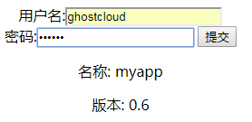

# myapp介绍

## 简介
myapp是基于Beeg框架实现的Web应用程序，主要实现了以下功能
1. 用户注册，登录，登录密码实现了储存加密
2. 登录后查看用户个人介绍以及UserAgent,ip,主机名以及产品名称和版本号等
3. 当myapp-cli连接服务器后，服务端定时返回时间以及返回客户端输入的内容

## 页面功能简介
### 用户注册
1. 用户输入用户名密码以及个人介绍，点击提价按钮即可完成注册功能
  
2. 相应的数据库中增加一条记录,并且密码经过安全加密
  

### 登录
1. 输入用户名密码进行登录  
  
2. 登录成功后跳转user/profile页面，显示以下信息
  

### 客户端-服务端通信  
1. 服务端定时向客户端返回时间消息，并且返回客户端输入的消息
  

## 接口说明
1. 注册接口-显示(GET)/提交(POST)
```
http://192.168.34.134:8080/user/signup
```
2. 登录接口-显示(GET)/提交(POST)
```
http://192.168.34.134:8080/user/login
```
3. 显示user_profile(GET)
```
http://192.168.34.134:8080/user/profile/
```  

## 部署myapp
1. 运行Makefile文件，自动编译myapp项目，生成rmyapp:0.6镜像
2. 上传镜像到EKOS
3. 拉取mysql镜像并且上传到集群
4. 创建nfs服务器，创建相应储存目录
5. 进入EKOS存储管理，添加nfs存储
6. 创建mysql服务以及myapp服务，myapp从环境变量中读取连接数据库的Ip地址
7. 创建相应的负载均衡，并添加转发规则
8. 完成部署
## 遇到的问题
1. 当myapp-cli输入字符串时有空格，相应服务端返回的消息会出错
```
解决:因为使用fmt.Scan()函数会默认以空格分割字符串，因此需要使用忽略输入字符串中包含空格的函数
```
2. 使用bufio.Reader中的ReadString()函数时，\r不会转义
```
解决:使用ReadLine()函数，会自动忽略输入时的\r
``` 
## kubectl命令操作
1. 应用副本数扩展为4个,拓展前
```
[root@node1 ~]# kubectl get pod
NAME                                    READY     STATUS    RESTARTS   AGE
default-http-backend-3138300093-891j3   1/1       Running   0          5d
lb-myapp-754059880-l3d5d                1/1       Running   0          5d
lb-mysql-1206913700-4rfcd               1/1       Running   0          5d
myapp-service-3880003149-5kd29          1/1       Running   0          5d
mysql-service-0                         1/1       Running   0          5d

```
拓展后
```
$ kubectl scale --replicas=4 deployment/myapp-service
[root@node1 ~]# kubectl get pod
NAME                                    READY     STATUS    RESTARTS   AGE
default-http-backend-3138300093-891j3   1/1       Running   0          5d
lb-myapp-754059880-l3d5d                1/1       Running   0          5d
lb-mysql-1206913700-4rfcd               1/1       Running   0          5d
myapp-service-3880003149-5kd29          1/1       Running   0          5d
myapp-service-3880003149-btvlj          1/1       Running   0          34s
myapp-service-3880003149-f363w          1/1       Running   0          34s
myapp-service-3880003149-jl4cs          1/1       Running   0          34s
mysql-service-0                         1/1       Running   0          5d

```
2. 查看pod所在的node信息
```
[root@node1 ~]# kubectl get pods -o wide
NAME                                    READY     STATUS    RESTARTS   AGE       IP               NODE
default-http-backend-3138300093-891j3   1/1       Running   0          5d        10.233.75.17     node2
lb-myapp-754059880-l3d5d                1/1       Running   0          5d        192.168.34.134   node3
lb-mysql-1206913700-4rfcd               1/1       Running   0          5d        192.168.34.133   node2
myapp-service-3880003149-5kd29          1/1       Running   0          5d        10.233.71.21     node3
myapp-service-3880003149-btvlj          1/1       Running   0          2m        10.233.71.28     node3
myapp-service-3880003149-f363w          1/1       Running   0          2m        10.233.75.24     node2
myapp-service-3880003149-jl4cs          1/1       Running   0          2m        10.233.75.25     node2
mysql-service-0                         1/1       Running   0          5d        10.233.75.16     node2
```
3. 查看pod输出的日志
```
$ kubectl logs -f myapp-service-3880003149-5kd29 
I1117 02:42:49.743409       1 server.go:61] 
------------begin to run echo service!---------------
2017/11/17 02:42:49 [I] [asm_amd64.s:2197] http server Running on http://:8080
2017/11/17 02:45:59 [D] [server.go:2568] | 192.168.34.134| 200 |   4.979035ms|   match| GET      /     r:/
2017/11/17 02:45:59 [D] [server.go:2568] | 192.168.34.134| 200 |    256.767µs|   match| GET      /static/js/reload.min.js
2017/11/17 02:46:08 [D] [server.go:2568] | 192.168.34.134| 200 |    923.928µs|   match| GET      /user/login   r:/user/login
2017/11/17 02:46:08 [D] [server.go:2568] | 192.168.34.134| 404 |   1.338479ms| nomatch| GET      /favicon.ico
<nil>
2017/11/17 02:46:17 [D] [server.go:2568] | 192.168.34.134| 200 |   14.17333ms|   match| POST     /user/login   r:/user/login
2017/11/17 02:46:22 [D] [server.go:2568] | 192.168.34.134| 200 |    961.692µs|   match| GET      /user/login   r:/user/login
2017/11/17 02:46:31 [D] [server.go:2568] | 192.168.34.134| 200 |   1.463364ms|   match| GET      /user/signup   r:/user/signup
2017/11/17 02:46:39 [D] [server.go:2568] | 192.168.34.134| 200 | 313.469614ms|   match| POST     /user/signup   r:/user/signup
2017/11/17 02:46:42 [D] [server.go:2568] | 192.168.34.134| 200 |    967.597µs|   match| GET      /user/signup   r:/user/signup
2017/11/17 02:46:47 [D] [server.go:2568] | 192.168.34.134| 200 |    902.637µs|   match| GET      /user/login   r:/user/login
2017/11/17 02:46:54 [D] [server.go:2568] | 192.168.34.134| 302 | 260.070794ms|   match| POST     /user/login   r:/user/login

```